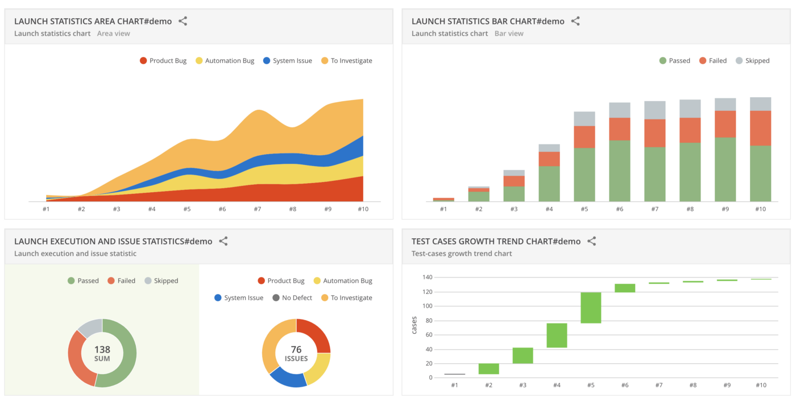
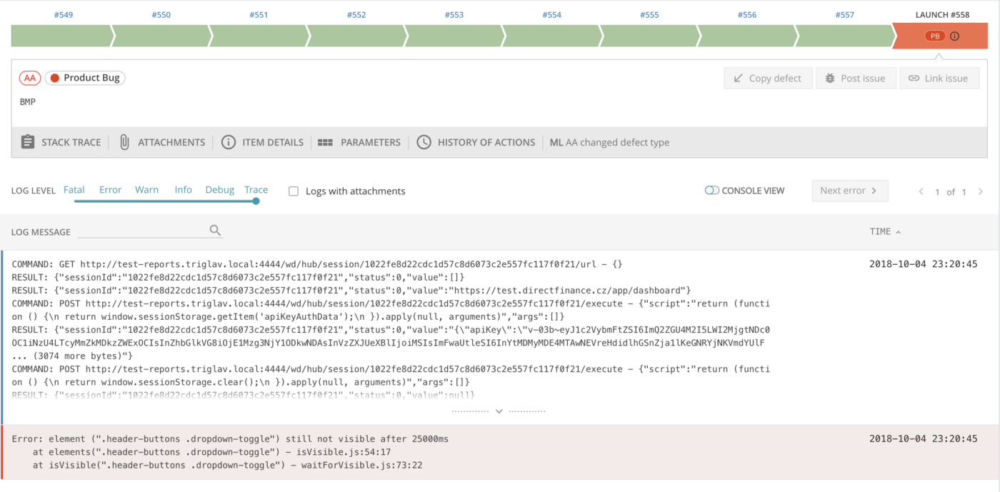
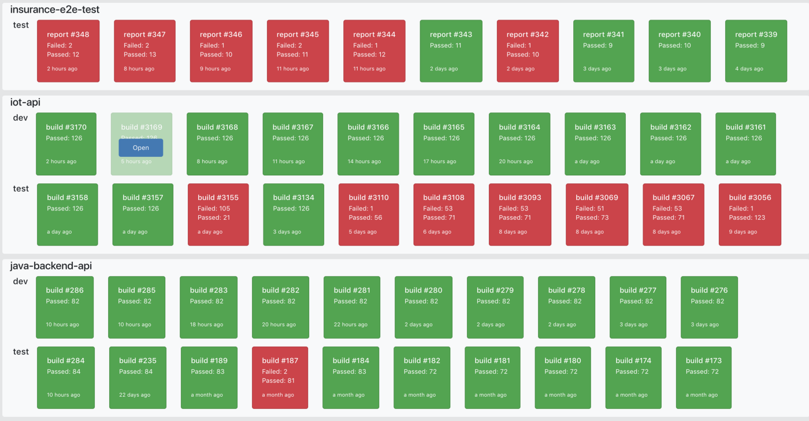
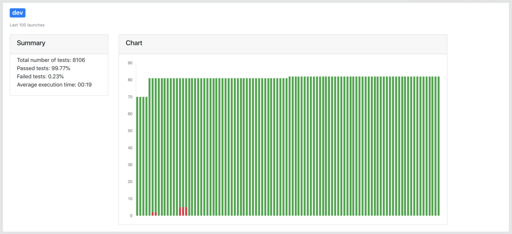

From my experience, the key part of a good testing infrastructure is test result reporting. For some reason, this topic is overlooked by the testing community. You can find lots of resources on how to learn this tool and that framework and which is better than others, but very little has been written on how to tackle test results management. I will try to demonstrate why you should care about test result management too.

The best open source solution I was able to find is ReportPortal.io, developed by EPAM. ReportPortal is an AI-powered tool allowing you to aggregate and analyze test results and more. With ReportPortal you will leverage your test automation architecture to the next level. It made my life easier especially for these two capabilities:

## Debugging tests

Debugging tests in ReportPortal got a much easier way than it would be from a CI tool. You know the situation when your tests fail and you have to open your CI and look in very long console output for given error at the very end. And then search for it further until you find your assertion error. And this gets even more frustrating when there is a couple of errors. With ReportPortal you will be able to navigate through your failed test in a more sane way.

You can add a description to a failed scenario and sort them to predefined categories, or extend them by adding your own. Eg. if a test has failed because of timeout you can mark it as “System issue” or if it is an actual product change you put it in the “Product change” category. At the beginning you have to do it manually but once you gather enough data ReportPortal’s AI will do it instead of you.

If you log additional information as communication logs you can send them to ReportPortal as well. This will depend on your test framework integration, but you can either log them directly or add them as an attachment. You will get the assertion error and test logs in one place, with that you will be able to find out what was going on pretty quickly and easily.

##Tracking history and statistics

Tracking the history of your test results will allow you to spot repeating problems more easily and thus take further action on preventing them. All that data gathered in ReportPortal gives you more detailed statistic insight into your tests and application under test. You will be able to visualize test coverage, pass/fail ratio, average run time, and more. Regular CI tool history limits your statistics data to pass/fail statistics over a couple of last builds. But that's it. You do not get statistics on which particular tests have failed. With ReportPortal you will be able to get an overview of most often failing tests.

 in ReportPortal")

ReportPortal offers nice graphs but it has two flaws. You can’t share them with anonymous users and you cant group them in one big dashboard across all your projects (public dashboard will be added in the future). Fortunately, ReportPortal has decent APIs (you can find the swagger definition by navigating to the API section in the application) that you can use it to build your own dashboard on top of it as we did in my organization. Thus we can easily share the dashboard with anyone in your team. Our custom dashboard consists of two parts — a general overview and a detailed project view. Overview displays little cards for the last 10 test runs. And if you click on it you will be redirected to the given test run in ReportPortal. Dashboard overview gives us a very quick grasp of current health across all projects.

On the other hand, the detailed view displays data for the last runs (max 100). And additional statistics like a total number of tests executed, pass and fail ration, average time execution, and test coverage improvements over time. Everything is accessible to every member of our team.

A publicly accessible dashboard gives to your automation visibility and it helps to increase test awareness as well. You do not need to send static HTML reports to your manager anymore. Anyone from management, product owners, development team, or stakeholders can have a look at the current state of your product. In case of failing tests they can raise an important question of why some tests are failing, what does it mean for your product and what are you going to do about it.

