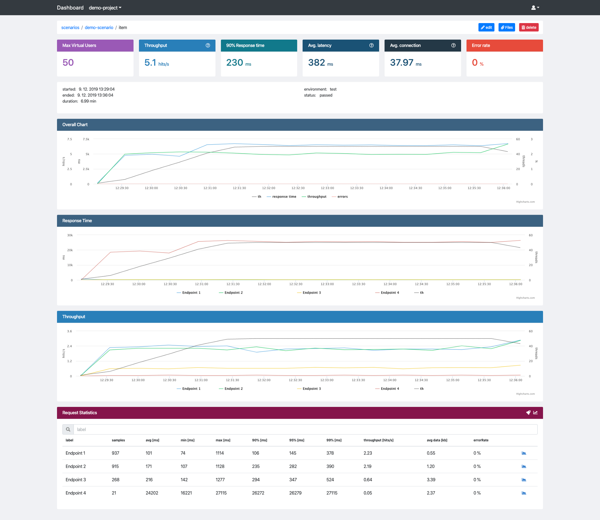
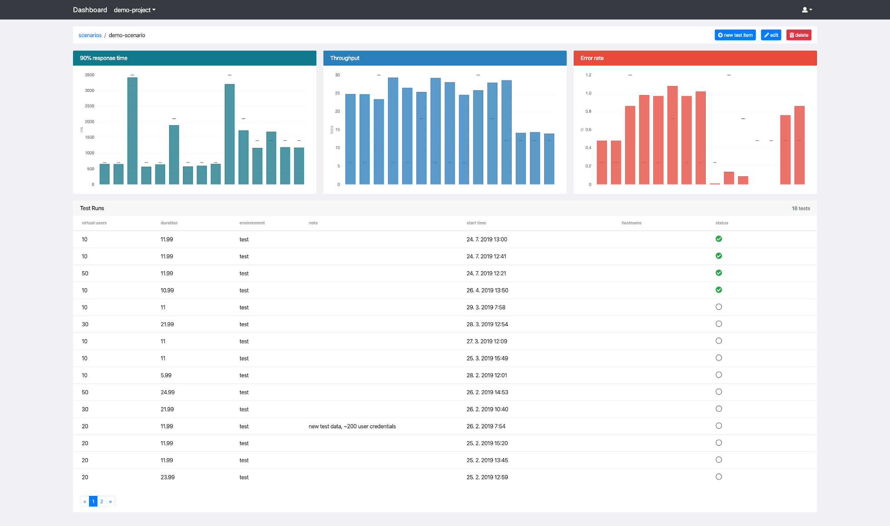
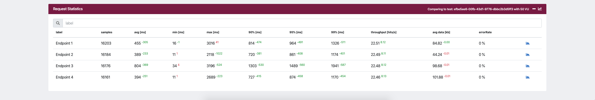
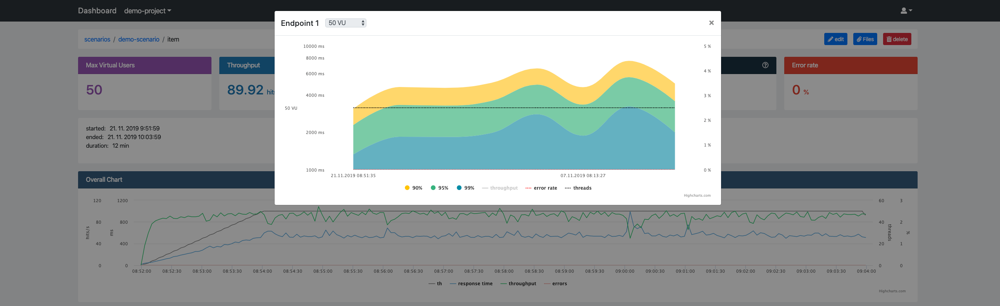
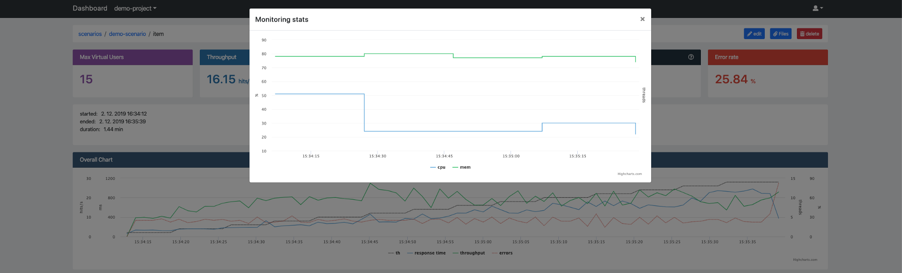

Taurus and JMeter became my go-to performance tools very quickly. JMeter is considerer to be industry standard with very strong community support and Taurus creates a wrapper around JMeter (and other performance testing tools) and expose neat abstraction which simplifies the complexity of JMeter and automation. Together they create incredibly powerful performance testing solution. The only major issue I had with them is inconvenient HTML report and test result management in case you do not want to pay for BlazeMeter.

In theory this could be solved by e.g. Grafana and underlying database. While it works very well for storing and visualising data, it does not work so very well in comparison of those reports in retrospective views. BlazeMeter provides nice reports which help to mitigate this problem, but unfortunately I was not able to find any OSS alternative to it. For this reason I have decided to create [Jtl Reporter](https://github.com/ludeknovy/jtl-reporter).



Jtl Reporter could be defined as JMeter and Taurus performance result reporting and management tool. Jtl Reporter is meant to be used as addition to Grafana. And its main objective is to give you the possibility to store test reports and compare them with ease.

### Compare test runs

Run couple of measurements and you are ready to start comparing them. Go to test run detail and click “chart icon” in Request statistics card header. You can choose another test run you want it to compare to. After confirmation you get updated request statistics table.



The superscript text numbers indicates whether the current test run result is better (green) or worse (red) compared to selected test run and what is the difference. If you compare two test runs with either different environments or virtual users (threads) you will get a warning, because such a comparison could be misleading.

### Set test reference

If you tuned your application to a desired state you can set the test run as a reference for other tests. This can be achieved by clicking edit button in test detail and checking set as base run . If there is reference run in given scenario each test detail will display “rocket” icon in Request Statistics. It gives you short cut for quick comparison with a test run reference.

### Track changes

To track individual label (endpoint) changes over time you can click blue “chart icon” in Request Statistics table. The chart displays 90, 95 and 99 percentiles trends. You have the possibility to compare all results (last 100) or filter them by virtual users which gives you less misleading overview.



## How to get started ?

Its easy to get Jtl Reporter up and running with docker-compose. Clone this [repository](https://github.com/ludeknovy/jtl-reporter) and run:

```
docker-compose up -d
```

Wait for it to start up and open: http://IP_ADDRESS:2020

To log-in use default credentials (change them afterwards):

```
username: admin
password: 2Txnf5prDknTFYTVEXjj
```

Once you logged in you have to create new project and scenario before you can upload any performance tests data. To create new project click on user icon at the top menu, then administrate — add project . Enter project name and confirm. Now you need to obtain an api token by clicking api tokens and then add token . Finally head to project detail by selecting it in projects dropdown at top menu and click add scenario. Enter scenario name and confirm. Now you are all set and we can integrate with taurus.

## Taurus integration

One of the convenient features taurus gives you are the services namely [shell exec service](https://gettaurus.org/docs/ShellExec/). It allow us to execute commands during test execution stages. We are going to use post-proces stage for uploading test results. The taurus configuration can look like:

```yaml
services:
  - module: shellexec
    post-process:
      - python $PWD/helper/upload-kpi.py -p ${PROJECT} -s ${SCENARIO} -e ${BASE_URL} -host ${HOSTNAME} -ec $TAURUS_EXIT_CODE -er "${TAURUS_STOPPING_REASON:-''}"
```

Example of upload-kpi.py script can be found [here](https://github.com/ludeknovy/jtl-reporter/blob/master/scripts/upload_jtl.py). Do not forget to provide it with api token generated earlier (to avoid 401 error), project and scenario name. I do store them in the same taurus yaml file. The whole taurus yaml file can look like:

```yaml
included-configs:
  - ./bzt.config.yml
settings:
  env:
    PROJECT: yourProjectName
    SCENARIO: yourScenarioName
execution:
  concurrency: 50
  ramp-up: 2m
  hold-for: 30m
  scenario: myScenario
scenarios:
 myScenario:
   script: jmx/myScenario.jmx
services:
  - module: shellexec
    post-process:
      - python $PWD/helper/upload-kpi.py -p ${PROJECT} -s ${SCENARIO} -e ${BASE_URL} -host ${HOSTNAME} -ec $TAURUS_EXIT_CODE -er "${TAURUS_STOPPING_REASON:-''}"
```

If you want to collect monitoring logs add to your yaml taurus configuration file another service:

```yaml
services:
  - module: monitoring
    ~local:
    - interval: 20s
      logging: True
      metrics:
      - cpu
      - disk-space
      - mem
```




Run your JMeter test with Taurus and after it finishes the script will pick up all the files (kpi.jtl, error.jtl and monitoring_logs.csv) and upload them to Jtl Reporter.