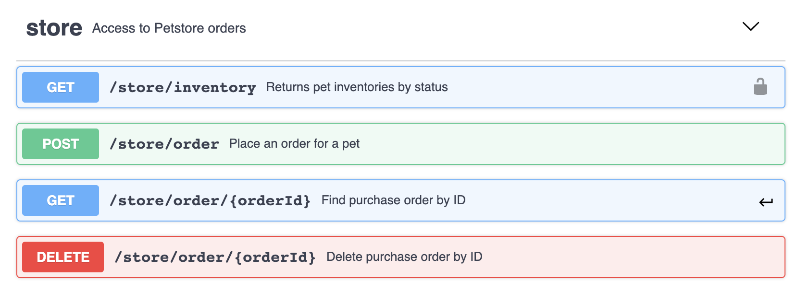

In the other article, I showed you how to create[ custom matcher for API status code](/blog/custom-status-code-matcher/). And today we are going to look at how to do the same for easy and fast testing of API response definition.

For this purpose, we are going to need [Schemathesis](https://github.com/kiwicom/schemathesis) library. This tool makes API definition testing very easy. It could be use as CLI or in-code as standard python package. And this is how Schemathesis describes itself:

>Schemathesis is a tool for testing your web applications built with Open API / Swagger specifications.
It reads the application schema and generates test cases which will ensure that your application is compliant with its schema.

Thus Schemathesis can be used not only to assert that API response conforms to API definition but can be used to do property-based testing for specified API input. In this article, we are going to focus only on API response assertions. If you'd like to know more about Schemathesis check this [post](https://code.kiwi.com/schemathesis-property-based-testing-for-api-schemas-52811fd2b0a4) from its author.

As in the previous article we use PyHamcrest for custom matcher implementation. We need to import `Case` class from schemathesis library to do the actual response definition validation. The following custom matcher implementation assumes usage of `requests` library for performing HTTP request. But this could be easily adjusted for any http library of your choice.

```python
from hamcrest.core.base_matcher import BaseMatcher
from requests import Response
from schemathesis import Case

class SatisfyApiSpec(BaseMatcher):
    def __init__(self, schema, spec_url_template: str):
        self._schema = schema
        self._spec_url_template = spec_url_template
    def _matches(self, item: Response):
        if not item:
            return False
        method = item.request.method
    try:
        endpoint = self._schema.endpoints[self._spec_url_template][method]
        Case(endpoint).validate_response(item)
    except KeyError:
        raise Exception(f'Unable to map url: {self._spec_url_template} with method: {method} to provided schema')
    except AssertionError as assertError:
        raise Exception(assertError)
    return True

def satisfy_api_spec(schema, spec_url_template: str):
    return SatisfyApiSpec(schema, spec_url_template)
```

This expose `satisfy_api_spec` function which can be imported in our test file and used inside PyHamcrest's `asset_that` method.

```python
assert_that(response, satisfy_api_spec(schema, spec_url_template=’/store/order’))
```

The `satisfy_api_spec` accepts two parameters — `schema` and `spec_url_template`. The `schema` can be initialized in multiple ways — `from_path`, `from_dict`, `from_uri`, `from_file` and `from_wsgi`. And `spec_url_template` is API url path template as specified in open api specification. The whole test could look like this:

```python
import schemathesis
from hamcrest import assert_that
from utils.matchers.response_schema_matcher import satisfy_api_spec
schema = schemathesis.from_uri("http://0.0.0.0:8080/swagger.json")
def test_get_store_orders():
    response = requests.get('http://0.0.0.0:8080/store/order'))
    assert_that(response, 
      satisfy_api_spec(schema,  spec_url_template=’/store/order’))
```

In case actual API implementation differs from API definition you will get a validation with detailed error message on which specific property of the actual response does not conform to API definition.

Happy API testing.
