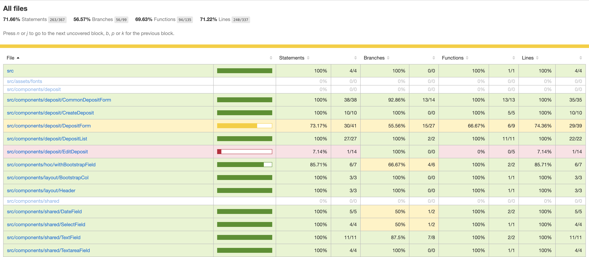

I have been playing with Playwright for some time, and their documentation (they even have [blog post](https://playwright.tech/blog/tracking-frontend-coverage-with-playwright) about it) gave me an idea of measuring code coverage of E2E tests.

## What is Playwright?
Playwright is one of the newest UI testing tool, which describes itself as a tool "to enable cross-browser web automation that is ever-green, capable, reliable and fast." (Clearly they market itself as selenium competitor as selenium is often connected with terms like "unreliable" and "slow") Playwright has great API, auto waits, multiple browser support (Chromium, WebKit, Firefox), intercepting networks, it supports automatic code coverage collection and more.

## Why would I need a code coverage of E2E tests?
The code coverage metric is widely connected with unit tests. Primarily because it is easy to measure it for unit tests and every decent testing framework supports it out of the box. Code coverage is much less considered when talking about API tests or E2E tests. I bet the main reason is, that it is not so easy to get it - just try to google API code coverage and compare it unit code coverage. In the second case, Google returns many more results.

Code coverage of E2E tests should not be used for dull 100% coverage goal (as with unit tests), since it may bring more problems than gain. But rather it should be used as an indicator. Indicator of whether we have not forgotten to cover any business critical scenario.

## How do I get a code coverage?
I was using playwright together with Jest. The playwright community contains [playwright-jest](https://medium.com/r/?url=https%3A%2F%2Fgithub.com%2Fplaywright-community%2Fjest-playwright) template for jest framework. This allows you to create `jest-playwright.config.js` where you can set up all playwright settings. In our case, we want to set `collectCoverage` to `true`.

Another thing which is needed to gather code coverage, is to instrument your app. In my case I had to install `babel-plugin-istanbul` and add to `.babelrc` file:
```json
"env": {
    "development": {
        "plugins": ["istanbul"]
    }
}
```

Start your application in the development environment. To confirm you will be able to get coverage, go to console in dev tools, and type `__coverage__`. If you get an object, you are ready to collect code coverage with your E2E tests.

Add new command to your `package.json`:

```json
"test:e2e": "nyc --reporter=html jest"
```

You can choose whatever reporter you want. Istanbul provides plethoras of them.

Type `npm run test:e2e`. And once your test execution finishes you should get console output like this:



This report reminds us, that there is one area of the application which is not covered by E2E tests at all. And it's up to further risk consideration whether it should or not to be included in E2E test suite.