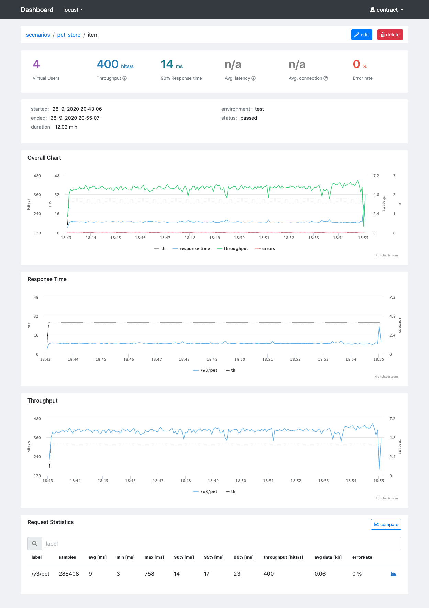

Locust.io is without any doubts an excellent performance testing tool. But by default, it lacks one very important feature - better reporting capabilities. Although out of the box its UI provides charts and label statistics, the charts are not persistent. Fortunately, the label statistics can be downloaded in CSV during or after the test run. The issue with end result CSV statistics is that you lose a significant amount of information - the test progress. If there was any considerable performance drop or error rate spike, you won’t know at what time this had happened. Thus, not able to correlate it to backend service metrics. At last but not least manual storing and comparing CSV files is counter-intuitive and error-prone.



As I described in another article I had a very similar issue with JMeter and [I solved it by implementing Jtl Reporter](https://www.ludeknovy.tech/blog/generate-intuitive-jmeter-reports-with-jtlreporter-and-taurus/). By using [Jtl Reporter](https://github.com/ludeknovy/jtl-reporter) you will get neat performance reports from your tests with the possibility for convenient comparison, test reports management and easily share it with anyone on your team (now you can get rid of HTML reports).

Luckily Locust.io is very hackable by its nature, and extending it is easy thanks to its well-documented event API. I have created a listener that collects data during the performance and saves them into JTL file which conforms JMeter format. Here are two caveats regarding the listener  - it was developed for distributed mode and some of the data (latency and connection time) are not available when compared to JMeter output as Locust.io does not provide them.

## How do I get started?
No worries, its fairly easy and straightforward, there is just a couple of things you need to do:
1. Deploy Jtl Reporter. Just follow [the installation steps](https://github.com/ludeknovy/jtl-reporter#installation-steps) in the readme of the project repository.
2. Create a new project and scenario in your Jtl Reporter instance.
3. Add [jtl_listener.py](https://github.com/ludeknovy/python-test-stack-demo/blob/master/jtl_listener.py) into the root folder with your Locust.io test scripts.
4. Add JtlListener class into your test scripts. This is done by adding these lines to your User class:
```python 
@events.init.add_listener
def on_locust_init(environment, **_kwargs):
    JtlListener(env=environment)
```
5. Upload JTL file into Jtl Reporter.

I have created a [demo repository](https://github.com/ludeknovy/python-test-stack-demo) with a simple test, so you can check it out and try to generate JTL file on your own. Again, simply follow the steps in the readme to install everything and how to run the tests. Do not forget to start PetStore API, otherwise, you will get but errors.

Let the test do its job for a while. You should now see JTL file in the `logs` folder in the root folder of the repository.  Take it and upload it to the Jtl Reporter to your project’s scenario and wait for the report. Once processed you will get a report like on the image above.

In an upcoming blog post we will look at how to upload the results to the Jtl Reporter automatically.

Happy testing!